

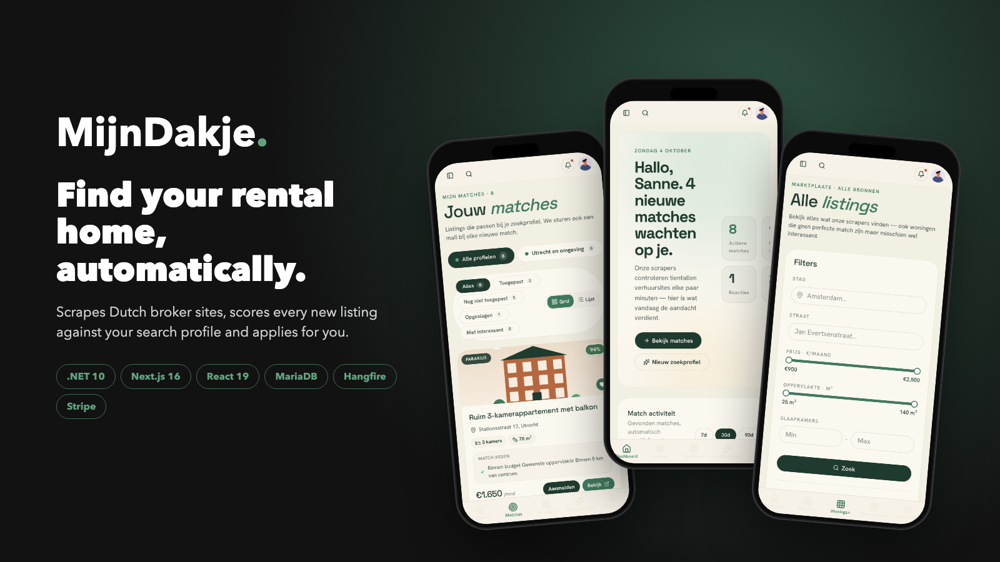

# MijnDakje

**A Dutch rental-housing platform that scrapes broker sites, scores every new listing against your search profile and applies on your behalf.**

> [!NOTE]
> This is a **showcase repository**. The production source code is private. Everything here
> (screens, mock-ups, diagrams) is generated from the real frontend running against **dummy data**.
> Names, listings, addresses and figures are fictional.

---

## The app in motion

  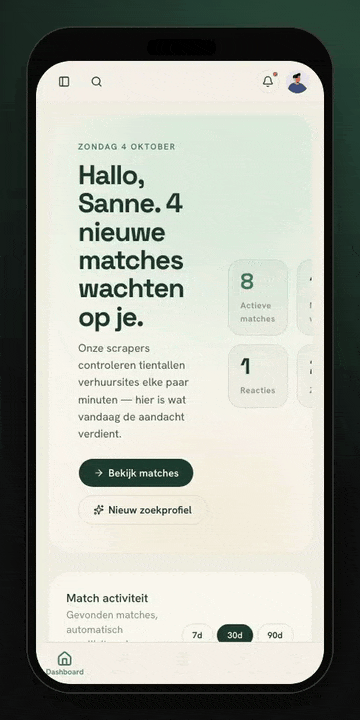
   The real Next.js build on a phone viewport: dashboard, matches, listings, search profiles.

---

## What it does

Finding a rental in the Netherlands means refreshing a dozen broker sites and reacting within minutes.
MijnDakje scrapes those sites continuously, scores each new listing against weighted search criteria,
alerts the renter and, for Pro users, submits the application automatically.

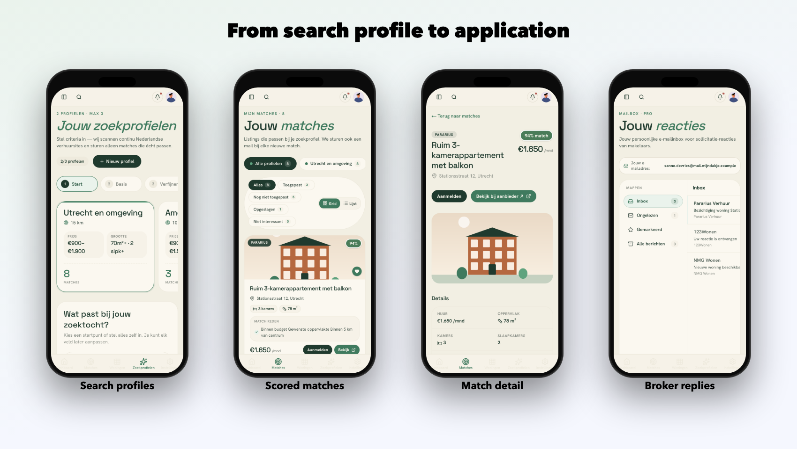

| For renters | For admins |
|---|---|
| **Search profiles**: location radius, rent, size, rooms, energy label, pets and more, each with a weight and a floor | **Platform dashboard**: users, subscriptions, MRR, match activity, scraper health |
| **Weighted match scores**: every listing gets a score with a per-criterion breakdown | **Broker management**: enable, pause, trigger and inspect scrape runs per broker |
| **Auto-apply (Pro)**: apply automatically above a score threshold, or approve manually | **User management**: roles, subscriptions, profiles, matches |
| **Mailbox**: broker replies arrive in a personal inbox | **System settings**: registration, e-mail types, auto-apply switch |
| **Notifications**: e-mail, push and a notification buddy who gets the alerts too | **Affiliates**: sign-up, review, commissions |
| **Billing**: Basic and Pro tiers via Stripe, referral credit | |

### Admin console

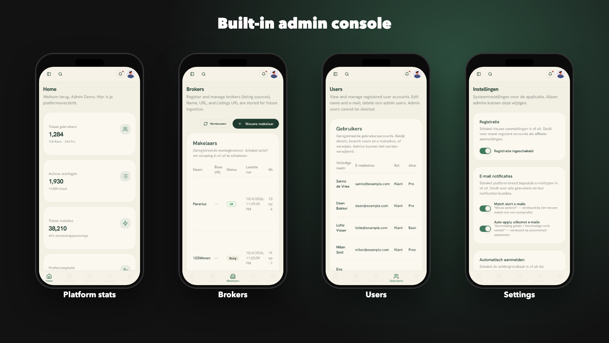

### Languages

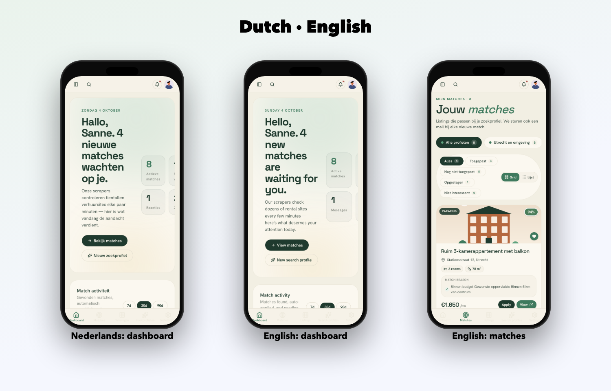

---

## Architecture

A Next.js frontend proxies to an ASP.NET Core API built in Clean Architecture layers. Scraping, matching
and applying run in a separate Hangfire worker so the API stays responsive.

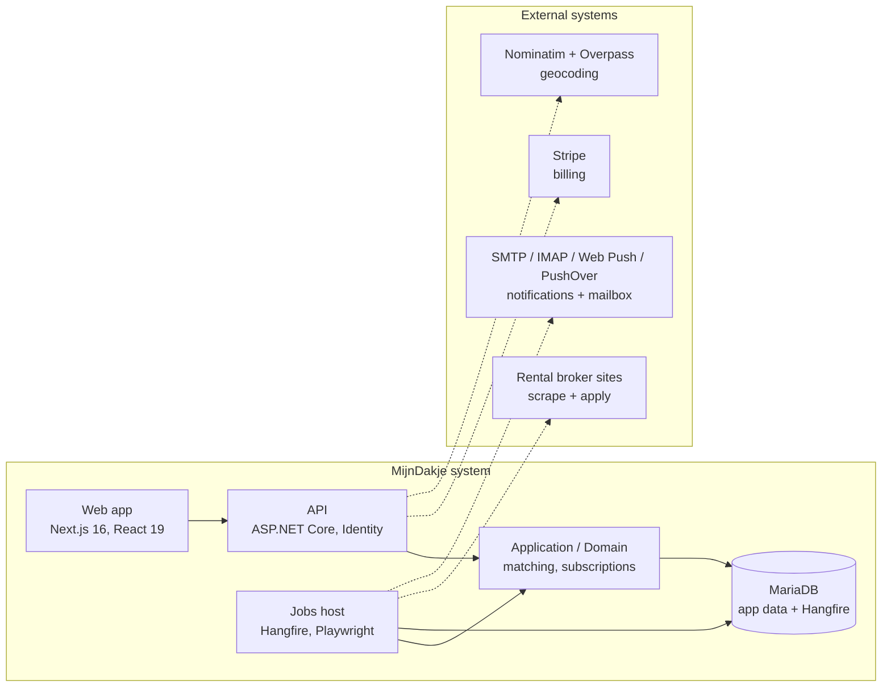

### Domain model (simplified)

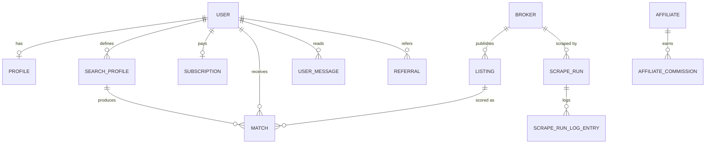

---

## Tech stack

| Layer | Technology |
|---|---|
| **Client** | Next.js 16 (App Router), React 19, TypeScript, Tailwind v4, shadcn/ui, Recharts, Leaflet, next-intl (nl / en) |
| **Backend** | .NET 9, ASP.NET Core, Clean Architecture (Domain, Application, Infrastructure, API, Jobs) |
| **Auth** | ASP.NET Core Identity, cookie session, 2FA |
| **Data** | MariaDB 11.8, EF Core (Pomelo) with migrations |
| **Background work** | Hangfire (MySQL storage) with recurring scrape, match, apply and cleanup jobs |
| **Integrations** | Stripe, Playwright broker scrapers, Nominatim, Overpass, MailKit (SMTP/IMAP), Web Push, PushOver |
| **Observability** | OpenTelemetry (Prometheus exporter), health checks |
| **Local dev** | .NET Aspire AppHost, Docker Compose |
| **Testing** | xUnit + Moq (backend, 470+ test methods), Vitest + Testing Library (frontend, 160+ cases), Playwright end-to-end suite |

---

## Engineering highlights

- **Strategy pattern per broker**: 29 broker strategies behind a resolver, with separate list, detail and apply flows, so a new broker is one class.
- **Weighted scoring with floors**: every criterion has a target, a floor and a weight; the UI shows the per-criterion breakdown behind each score.
- **Jobs isolated from the API**: scraping, matching, applying, mailbox polling and cleanup run in their own Hangfire host.
- **Idempotent billing**: Stripe webhook events are recorded so a replayed event is not processed twice.
- **Tier enforcement in the domain**: Basic and Pro limits (search profiles, auto-apply eligibility) are enforced server-side.
- **Security reviewed**: the repo carries a pentest findings document and security headers on the frontend.

---

## Delivery

Each service ships as a Docker image (API, Jobs, frontend) and the full stack runs with Docker Compose.

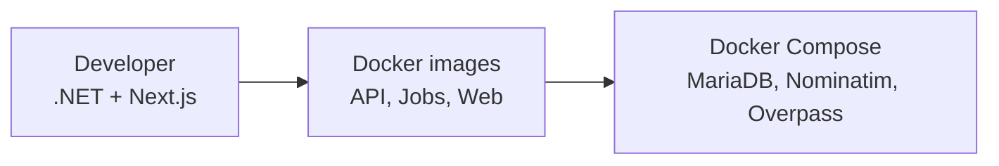

---

## Screens

<table>
  <tr>
    <td>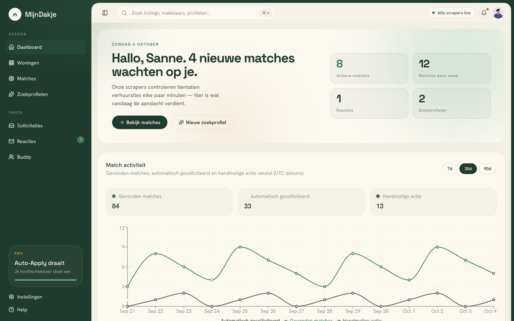</td>
    <td>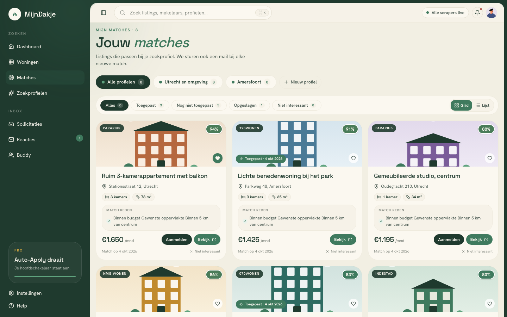</td>
  </tr>
  <tr>
    <td align="center">Dashboard</td>
    <td align="center">Matches</td>
  </tr>
  <tr>
    <td>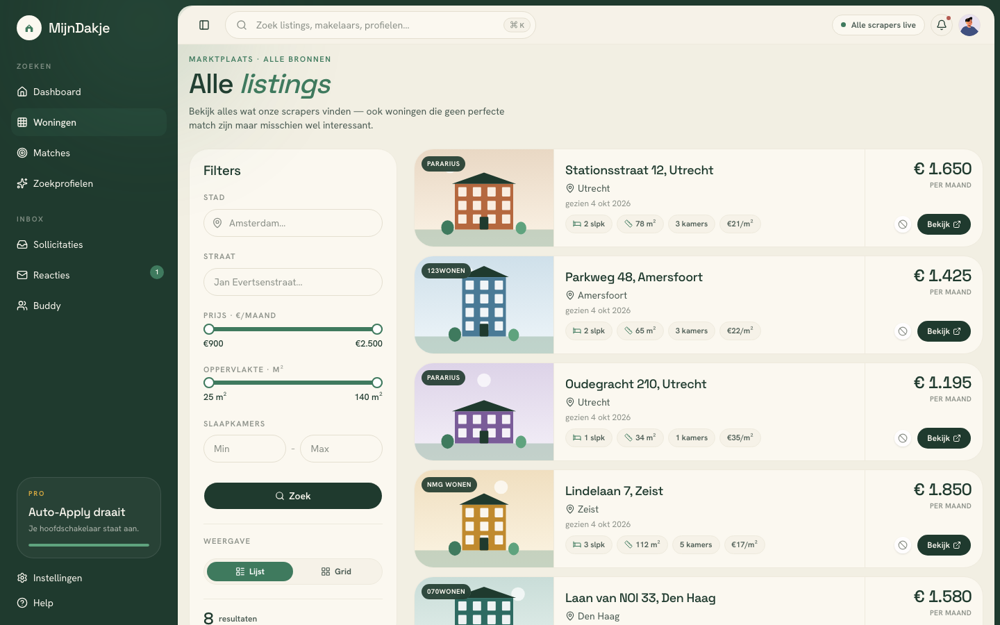</td>
    <td>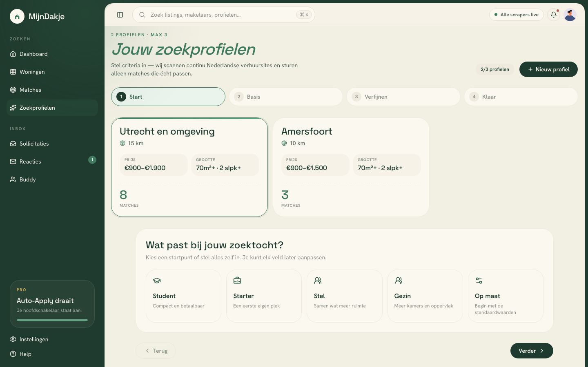</td>
  </tr>
  <tr>
    <td align="center">All listings</td>
    <td align="center">Search profiles</td>
  </tr>
  <tr>
    <td>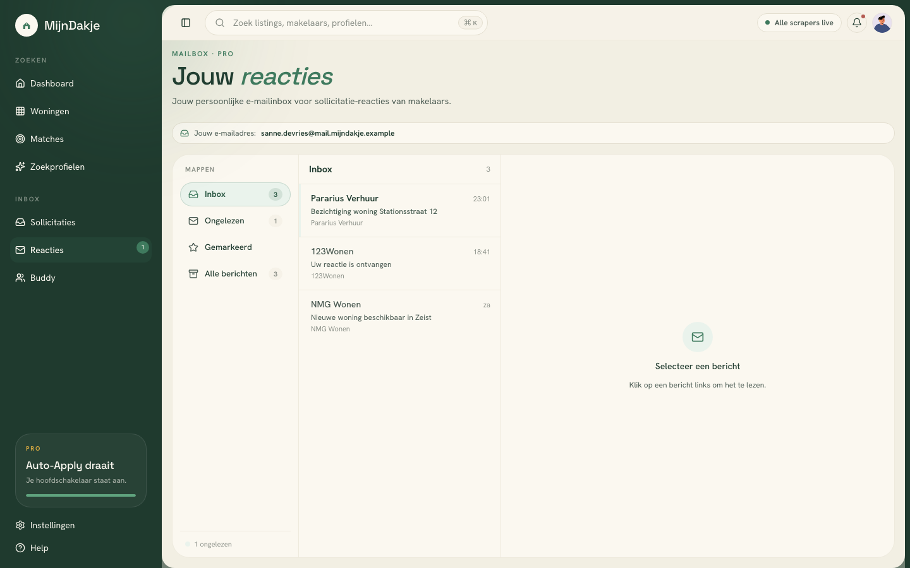</td>
    <td>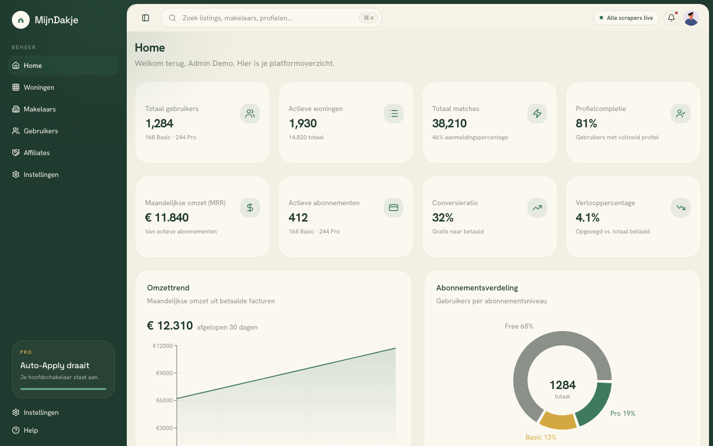</td>
  </tr>
  <tr>
    <td align="center">Mailbox</td>
    <td align="center">Admin dashboard</td>
  </tr>
  <tr>
    <td colspan="2">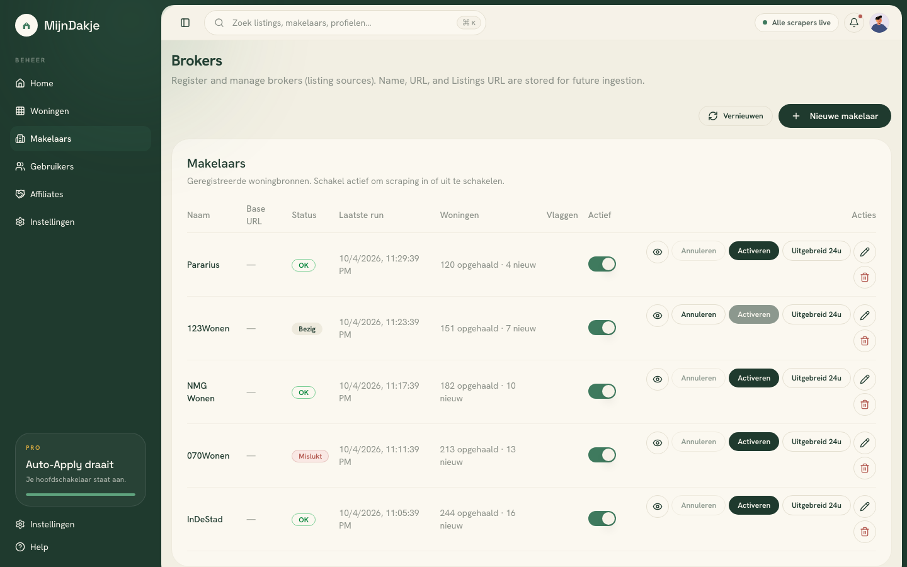</td>
  </tr>
  <tr>
    <td colspan="2" align="center">Admin: brokers</td>
  </tr>
</table>

---

Made by **[Mennova](https://mennova.nl)** · more projects on **[mennova.nl/cases](https://mennova.nl/cases)**

